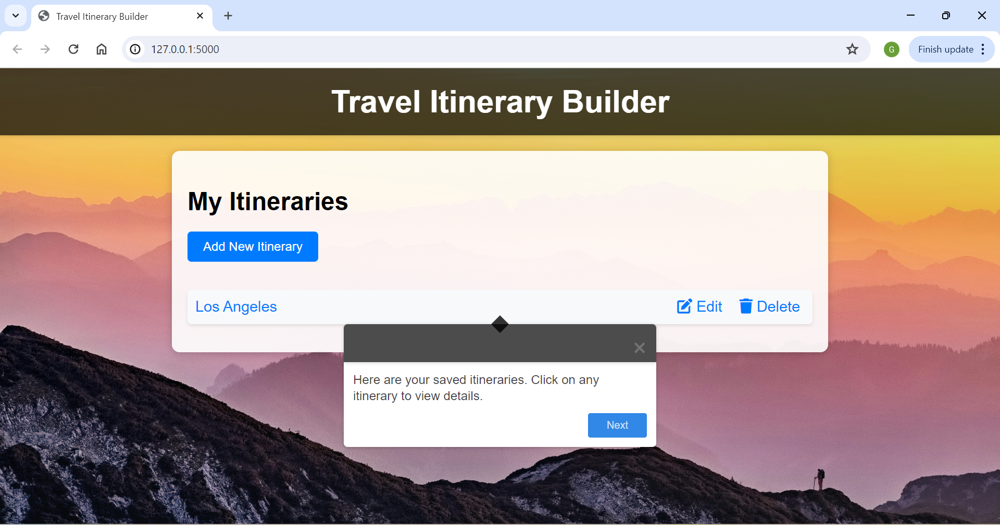
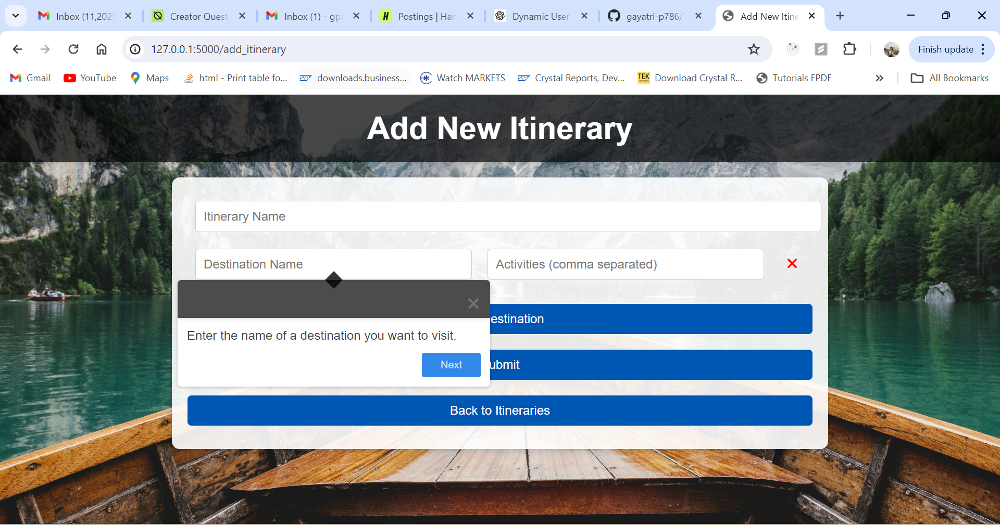
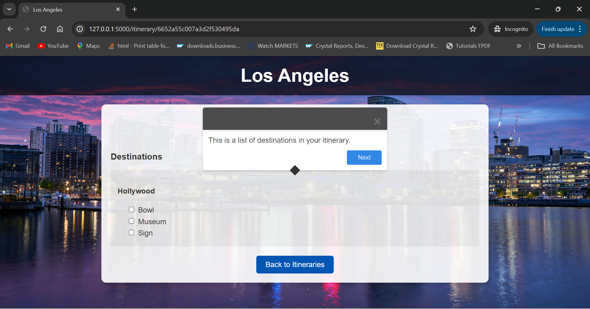
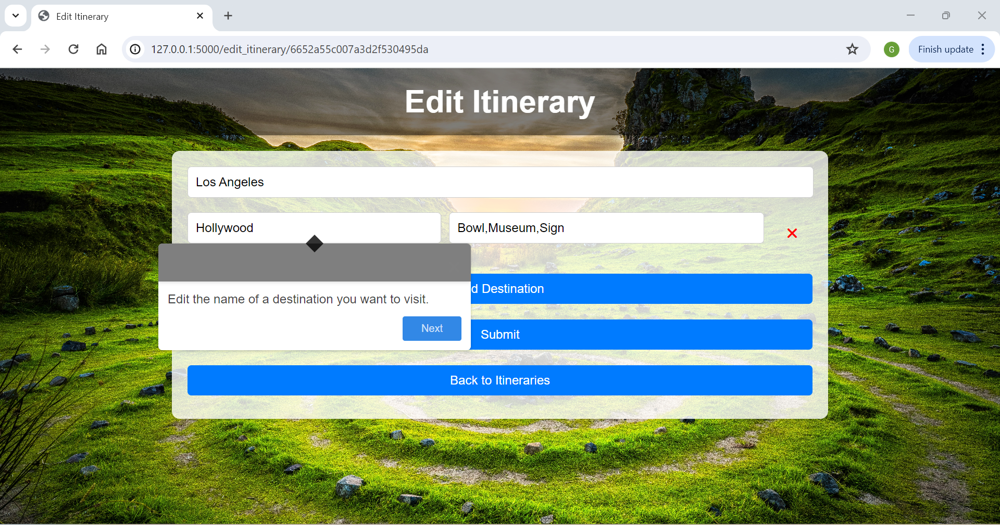

# Travel Itinerary Management System

The Travel Itinerary Management System is a web application designed to help users organize their travel plans by creating and managing itineraries for their trips. It allows users to add destinations, list activities for each destination, and check off completed activities.

## Features

- Add new itineraries with destination details and activities.
- Check off completed activities as you go.
- User-friendly interface for managing travel plans.

## Installation

1. Clone the repository:

```bash
git clone https://github.com/your_username/travel-itinerary.git
```

2. Navigate to the project directory:

```bash
cd travel-itinerary
```

3. Create a virtual environment:

```bash
python -m venv venv
```

4. Activate the virtual environment:

- On Windows:

```bash
venv\Scripts\activate
```

- On macOS and Linux:

```bash
source venv/bin/activate
```

5. Install dependencies:

```bash
pip install -r requirements.txt
```

6. Run the application:

```bash
python app.py
```

7. Open your web browser and visit `http://localhost:5000` to view the application.

## How to Use

1. Click on "Add New Itinerary" to create a new travel itinerary.
2. Enter the itinerary name, destination details, and activities.
3. Check off activities as you complete them during your trip.

## Using Shepherd.js

The Travel Itinerary Management System utilizes Shepherd.js to provide a guided tour for users on how to use the application. Shepherd.js is a JavaScript library for guiding users through your app with interactive tours.

## Demo Video

[](https://youtu.be/zNSAyJlz-L4)

## Screenshots








